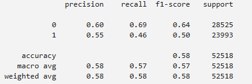

# NBA-Shot-Prediction

This project was inspired by my deep-rooted love for basketball and nostalgia for one of my favorite NBA seasons. As an avid sports fan, I’ve always been fascinated by how the game has evolved over time. I wanted to take a data-driven look at how player behavior and shot selection have changed, and explore whether machine learning could accurately predict shot outcomes using real in-game data. The project allowed me to combine my passion for sports with my technical skills in data science to uncover patterns behind some of basketball’s most exciting moments.

Using a detailed dataset from Kaggle that captured every shot from the 2016–2017 NBA regular season, I explored a range of machine learning models to predict shot outcomes based on factors like player, defender distance, shot location, and time remaining. This season held special meaning to me, so it was exciting to dive into the data and see what trends the numbers revealed when viewed through the lens of predictive analytics.

---

## 🏀 Objective

Build a machine learning model to predict whether a given shot in the 2016–17 NBA season would result in a make or a miss, using shot-level data including player, location, shot distance, shot type, and more.

---

## 📂 Dataset

- Source: [Kaggle - NBA 2016-17 Shot Log](https://www.kaggle.com/wh0801/NBA-16-17-regular-season-shot-log)

Example of the raw data:

---

## 🔍 EDA (Exploratory Data Analysis)

I performed visual and statistical analysis to understand the features most associated with shot success.

- **Heatmap of Correlations**  
  

- **Shot Chart by Location per Team**  
  

---

## 🤖 Modeling

We experimented with several classification models to predict shot outcomes:

- Logistic Regression  
  

- Naive Bayes  
  

- Random Forest  
  

**Best model:** Random Forest  
**Accuracy:** ~67%

---

## 🎯 Conclusion

Despite tuning and testing various models, results plateaued around 66–67% accuracy. This may reflect the unpredictable nature of basketball, where even perfect shots don’t always fall.

Future features that could improve performance include:

- Shot clock time
- Closest defender’s distance and identity
- Passes leading to shot
- Shot contest level
- Player fatigue or streaks

---

## 🧠 Applications

While the theoretical accuracy ceiling may not exceed ~85% due to randomness in the game, models like this still offer value in:

- Team strategy simulations
- Fantasy sports projections
- Betting markets

---

## 🚀 How to Run

1. Clone the repo  
   `git clone https://github.com/SammyBolger/NBA-Shot-Prediction`

2. Install dependencies  
   `pip install -r requirements.txt`

3. Run the notebook  
   `NBA_Shot_Prediction.ipynb`

---

## 📈 Future Work

- Integrate defender tracking data (SportVU)
- Use sequence models (RNNs) for dynamic shot prediction
- Deploy a web dashboard for interactive exploration

---

## 📬 Contact

- **LinkedIn:** [Sam Bolger](https://www.linkedin.com/in/sambolger/)
- **Email:** [sbolger@cord.edu](mailto:sbolger@cord.edu)

---
